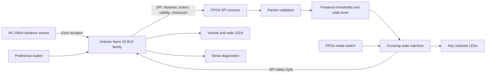
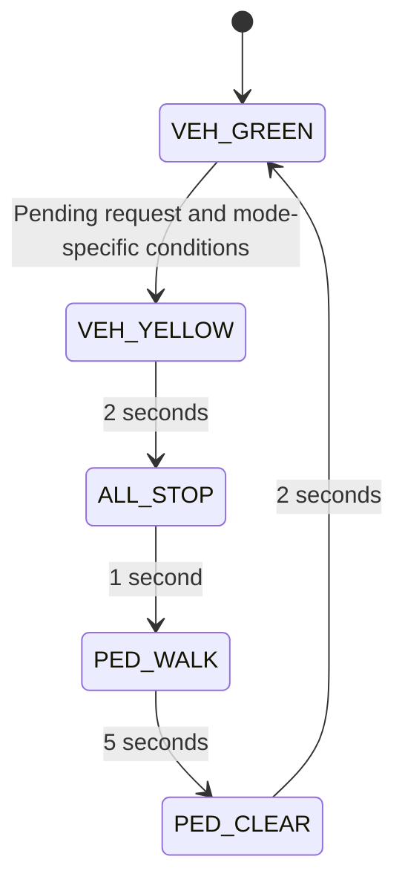

# Adaptive Traffic Light / Smart Crosswalk

## Project specification and final class presentation guide

Prepared September 10, 2026, from the repository source and the team's confirmation that the distance sensor is an **HC-SR04 ultrasonic sensor**. “Ultrasonic” describes the sound frequency; it is the appropriate term for this sensor.

This document describes the implemented design, identifies incomplete work, and provides a plan for producing the final presentation. Source inspection establishes what the code specifies, not whether it has passed compilation, simulation, or physical testing. No new hardware or simulation results were generated for this document.

## 1. Executive summary

The project is a tabletop pedestrian-crossing controller. It combines an Arduino Nano 33 BLE-family board, an HC-SR04 distance sensor, a pedestrian button, traffic LEDs, and an Arty A7 FPGA. The Arduino collects physical inputs and exchanges data with the FPGA. The FPGA determines the traffic phase and returns the light commands.

The central idea is to serve pedestrian requests when there is a gap in traffic, while enforcing minimum green time and a maximum request-wait threshold. A fixed-time mode provides a comparison baseline. Vehicle presence is represented by an object within a distance threshold; the prototype does not identify or count actual vehicles.

Suggested presentation thesis:

> We built a sensor-driven crosswalk prototype that separates physical sensing on an Arduino from deterministic traffic control on an FPGA. It uses distance measurements to decide when a pedestrian request can interrupt vehicle green, and supports a fixed-time baseline for comparison.

Use “built and demonstrated” only for behavior supported by the team's recordings or measurements. The repository contains implementation code, but does not contain a recorded end-to-end acceptance result.

## 2. Problem, scope, and objectives

### Problem statement

A fixed crossing schedule does not react to whether traffic is present. A pedestrian may wait even when the modeled road is empty. This project explores whether a simple presence measurement can allow earlier crossing service while retaining explicit traffic phases.

### Implemented scope

- One vehicle approach and one pedestrian crossing.
- One HC-SR04 used as a vehicle-presence proxy.
- One pedestrian request button.
- Vehicle red, yellow, and green outputs, plus pedestrian walk.
- Switch-selectable adaptive and fixed modes.
- Arduino-to-FPGA SPI packets with an XOR checksum.
- FPGA distance thresholds, stale-data detection, request handling, and timed state transitions.
- Serial status output and an FPGA state-machine testbench.

### Outside the current implementation

Multiple intersections, vehicle classification, traffic counting, pedestrian occupancy detection, network coordination, deployed road infrastructure, learned policies, and automated performance analysis are not implemented. The Python filenames suggest future calibration, simulation, training, and evaluation work, but those files are empty.

### Demonstration objectives

1. Show distance changes affecting the FPGA's vehicle-presence bit.
2. Show that a short valid pedestrian request is remembered during green.
3. Show earlier service for a traffic gap in adaptive mode.
4. Show eventual service under continuous detected traffic when sensor data stays valid.
5. Show the complete crossing sequence and compare it with fixed mode.
6. Explain the separation between intended behavior, simulation coverage, and physical evidence.

## 3. System architecture



The Arduino is the SPI master and the FPGA is the slave. The FPGA runs at 100 MHz, while Arduino SPI runs at 1 MHz in mode 0, most-significant bit first. Traffic decisions live in the FPGA; the Arduino displays those decisions through its output pins.

The division illustrates hardware/software integration and a finite-state machine implemented in synchronous logic. It is not evidence that an FPGA is necessary for a crossing this small; a microcontroller could also implement the timing rules.

## 4. Hardware and wiring specification

### Components

| Component | Role | Evidence or confirmation needed |
|---|---|---|
| Arduino Nano 33 BLE-family board | Sensor acquisition, SPI master, LED output | README specifies Nano 33 BLE Sense Rev2; confirm exact board from the physical setup |
| HC-SR04 | Ultrasonic distance measurement | Sensor model confirmed by the team |
| Arty A7 | FPGA traffic controller | Constraint filename targets Arty A7-100T; confirm physical board variant |
| Momentary button | Pedestrian request | Active-low input using internal pull-up |
| Red, yellow, green LEDs | Vehicle signal display | Record actual LED resistor values |
| Optional walk LED | Pedestrian signal display | Confirm whether installed |
| Breadboard, jumpers, power connections | Physical assembly | Document common ground and actual power routing |
| Echo voltage interface | Protect 3.3 V Arduino input | Confirm installed divider or level shifter |

### Arduino connections

These pin assignments come from the controller sketch. SPI header mappings are supported by the [official Sense Rev2 pinout](https://docs.arduino.cc/resources/pinouts/ABX00069-full-pinout.pdf); verify against the actual board variant.

| Arduino connection | Connected function | Direction relative to Arduino |
|---|---|---|
| D2 | HC-SR04 TRIG | Output |
| D3 | HC-SR04 ECHO through appropriate voltage interface | Input |
| D4 | Red LED through current-limiting resistor | Output |
| D5 | Yellow LED through current-limiting resistor | Output |
| D6 | Green LED through current-limiting resistor | Output |
| D7 | Button to ground; `INPUT_PULLUP` | Input |
| D8 | Optional walk LED through resistor | Output |
| D10 | FPGA chip select, active low | Output |
| D11 / COPI / MOSI | FPGA `CK_MOSI` | Output |
| D12 / CIPO / MISO | FPGA `CK_MISO` | Input |
| D13 / SCK | FPGA `CK_SCK` | Output |
| GND | Shared signal reference | Common ground |

### Electrical integration

The HC-SR04 datasheet specifies a 5 V supply. The Nano 33 BLE Sense Rev2 has 3.3 V I/O and is not 5 V tolerant. Treat the sensor's echo as a 5 V-domain signal and use a suitable divider or level shifter before D3. Document the actual circuit; the source code and repository do not establish that it is installed. Confirm trigger compatibility for the particular module and use level conversion if needed. See the [HC-SR04 datasheet](https://cdn.sparkfun.com/datasheets/Sensors/Proximity/HCSR04.pdf) and [Arduino board datasheet](https://docs-content.arduino.cc/resources/datasheets/ABX00069-datasheet.pdf).

Use a verified sensor power source and common ground. Record the chosen LED current-limiting resistors and check the board's GPIO current limits. Do not assume the Arduino's nominal 5 V header is available without checking the actual board configuration.

### FPGA connections in the repository

The following are FPGA **package pins**, not breadboard or connector positions. Map them to the physical Arty headers using the exact board's documentation before wiring.

| Top-level port | Package pin | Role |
|---|---|---|
| `CLK100MHZ` | E3 | 100 MHz clock |
| `sw[1]` | C11 | High = adaptive; low = fixed |
| `btn[0]` | D9 | Active-high controller reset |
| `CK_MISO` | G1 | Status to Arduino |
| `CK_MOSI` | H1 | Data from Arduino |
| `CK_SCK` | F1 | SPI clock |
| `CK_SS` | C1 | SPI chip select |
| `led[0]` | H5 | Vehicle green |
| `led[1]` | J5 | Vehicle yellow |
| `led[2]` | T9 | Vehicle red |
| `led[3]` | T10 | Pedestrian walk |

The XDC declares these signals as `LVCMOS33`. The unused `sw[0]` and `btn[1]` ports have no listed constraints; check their treatment in the implementation flow.

## 5. HC-SR04 measurement and presence detection

The HC-SR04 emits an ultrasonic burst after a trigger pulse and represents round-trip travel time as an echo pulse. Its datasheet describes a minimum 10 microsecond trigger, nominal 2 cm–4 m range, and recommends a measurement cycle over 60 ms. These are component specifications, not measured project accuracy. [HC-SR04 datasheet](https://cdn.sparkfun.com/datasheets/Sensors/Proximity/HCSR04.pdf)

### Implemented measurement sequence

1. Drive TRIG low for 2 microseconds.
2. Drive TRIG high for 10 microseconds, then low.
3. Measure the high ECHO pulse with `pulseIn`, using a 30,000 microsecond timeout.
4. Convert duration to integer millimeters.
5. Mark timeout, zero distance, or distance above 65,535 mm invalid.

The conversion implemented is:

```text
distance_mm = floor(duration_us × 343 / 2000)
```

This uses a sound-speed approximation of 343 m/s and divides the round trip by two. For example, 2,000 microseconds produces 343 mm. There is no temperature compensation or averaging. The numeric validity check does not enforce the sensor's rated operating range.

Sampling is scheduled every 60 ms, approximately 16.7 measurements per second. This is a nominal schedule: blocking echo measurement and serial output can affect loop timing. The 60 ms setting is also at the edge of the datasheet's recommendation; verify stable operation on the actual setup.

### FPGA presence thresholds

| Previous condition | New valid distance | Result |
|---|---|---|
| Clear | Nonzero and ≤250 mm | Vehicle present |
| Present | ≥350 mm | Clear |
| Either | Between 250 and 350 mm | Preserve previous state |

Using different entry and exit thresholds is hysteresis: it reduces repeated toggling near a single boundary. Thresholds represent tabletop object detection and have not been shown to be calibrated to actual traffic.

A checksum-valid packet resets the stale counter. An invalid sensor flag immediately clears sensor validity. No fresh packet for approximately 500 ms also clears validity. Invalid or stale data preserves the last presence bit, so consumers must inspect validity as well as presence.

For a “clear road” demo, use a reliable background target farther than 350 mm but within the sensor's usable range. Removing every reflector may produce a timeout, which means invalid data rather than a valid clear road.

## 6. SPI protocol

### Arduino request: five bytes

| Byte | Meaning |
|---|---|
| 0 | Magic value `0xA5` |
| 1 | Distance bits 15–8 |
| 2 | Distance bits 7–0 |
| 3 | Bit 0: button pressed; bit 1: sensor valid; other bits zero |
| 4 | XOR of bytes 0–3 |

Example: 300 mm, button pressed, valid sensor:

```text
A5 01 2C 03 8B
```

The Arduino holds chip select low across all five bytes, waits 2 microseconds before transfer and another 2 microseconds before releasing it. Forty SPI bits at 1 MHz take approximately 40 microseconds, excluding software and chip-select overhead.

`packet_interface.sv` accepts a packet when the magic and checksum match, then publishes distance, flags, and a one-cycle `packet_valid` pulse. XOR detects some transmission errors but is not a strong integrity mechanism.

### FPGA response: one status byte

| Bit | Meaning |
|---|---|
| 7 | Response marker, set to 1 |
| 6 | Vehicle red |
| 5 | Vehicle yellow |
| 4 | Vehicle green |
| 3 | Pedestrian walk |
| 2 | Request pending |
| 1 | Sensor valid |
| 0 | Vehicle present |

The SPI slave loads status for transmission at frame start and byte boundaries. The Arduino keeps the byte received during the fifth transfer. This is a status snapshot, not an explicit acknowledgment that the current sensor packet has already been processed. An updated state may be observed on a subsequent sample.

The Arduino treats bit 7 as response validity. There is no response checksum, sequence number, or freshness check. If bit 7 is clear, the LED update function returns without changing existing LED outputs.

## 7. Traffic controller behavior

### State sequence and outputs



| State | Vehicle output | Walk output | Duration or exit condition |
|---|---|---|---|
| `VEH_GREEN` (0) | Green | Off | Depends on mode and request |
| `VEH_YELLOW` (1) | Yellow | Off | 2 seconds |
| `ALL_STOP` (2) | Red | Off | 1 second |
| `PED_WALK` (3) | Red | On | 5 seconds |
| `PED_CLEAR` (4) | Red | Off | 2 seconds |

The walk indicator does not flash during clearance. Green continues indefinitely without an accepted request. Reset selects vehicle green and clears the pending request.

### Adaptive mode

Green changes to yellow only when all of these conditions hold:

- A pedestrian request is pending.
- Sensor data is valid.
- At least 3 seconds of vehicle green have elapsed.
- The vehicle-presence bit is clear, or the request has waited at least 10 seconds during green.

The maximum-wait parameter bounds waiting for departure from green under valid data. It is **not** a 10-second button-to-walk guarantee: yellow and all-stop add approximately 3 seconds. Invalid data can postpone service indefinitely.

### Fixed mode

A pending request starts yellow once the current green phase reaches 8 seconds. Vehicle presence does not affect this decision. The 8 seconds are measured from green entry, not from the button press. A request arriving after 8 seconds of green can therefore be served almost immediately.

New requests still depend on valid sensor data in the input logic and request latch, even in fixed mode. Once latched, a fixed-mode request does not require ongoing sensor validity to leave green.

### Request semantics

The input module creates a request pulse on a sampled rising edge of the button. The FSM accepts requests only during green and while sensor data is valid. It clears the pending request when entering walk. Presses during yellow, all-stop, walk, or clearance are not queued for another cycle. A held button is not intended to generate repeated crossings; there is no dedicated mechanical debounce filter.

### Timing examples for slides

These are approximate analytical examples, not measured results. Assume stable valid sensor data and a request shortly after entering green.

| Scenario | Yellow begins | Walk begins |
|---|---|---|
| Adaptive, road clear | Around 3 s after green entry | Around 6 s after green entry |
| Fixed, road clear | Around 8 s after green entry | Around 11 s after green entry |
| Adaptive, continuous presence | Around 10 s after request acceptance | Around 13 s after request acceptance |

The first two examples suggest a roughly 5-second advantage for that particular arrival timing. They do not establish an average improvement. Fixed mode can serve earlier than adaptive mode in the continuous-presence example.

## 8. Repository map and implementation status

Paths below are relative to this document.

| File or directory | Purpose and status |
|---|---|
| [Main controller sketch](../arduino/adaptive_traffic_light/adaptive_traffic_light.ino) | Full Arduino sensing, SPI, LED, and diagnostic implementation |
| [Sensor test sketch](../arduino/proximity_test/proximity_test.ino) | HC-SR04 CSV readings: `time_ms,distance_mm,valid` |
| [Proximity-test directory](../arduino/proximity_test/) | Also contains duplicate controller `.ino` and `.cpp` files; needs build cleanup |
| [FPGA top](../hardware/rtl/top.sv) | Connects modules and sets real-time parameters |
| [SPI slave](../hardware/rtl/spi_slave.sv) | Synchronizes and receives SPI signals; returns status |
| [Packet interface](../hardware/rtl/packet_interface.sv) | Magic/checksum validation and payload extraction |
| [Sensor input](../hardware/rtl/sensor_input.sv) | Hysteresis, stale timer, button edge detection |
| [Crossing FSM](../hardware/rtl/crossing_fsm.sv) | Traffic states, counters, request latch, outputs |
| [FPGA constraints](../hardware/constraints/arty_a7_100t.xdc) | Clock and package-pin assignments |
| [FSM testbench](../hardware/sim/tb_crossing.sv) | Six behavioral scenarios and green/walk overlap check |
| [Setup photo](phys_setup.jpeg) | Existing photo asset; inspect and annotate for slides |
| [Root README](../README.md) | Describes older APDS9960 milestone; does not match HC-SR04 implementation |
| `calibrate.py`, `simulator.py`, `train.py`, `evaluate.py` | Empty placeholders |
| `policies/` | Placeholder only; no trained policy |
| `data/README.md`, `hardware/README.md` | Empty documentation placeholders |

The implemented adaptation is a rule-based controller. Do not label it artificial intelligence, reinforcement learning, or a trained optimization system.

## 9. Build and reproducibility plan

These steps describe the intended workflow, not a build verified while writing this document.

### Arduino

1. Confirm the exact board variant and installed Arduino board package version.
2. Open `arduino/adaptive_traffic_light/adaptive_traffic_light.ino` as the main sketch.
3. Select the matching Nano 33 BLE-family board and connected port.
4. Compile and upload; save the successful build output and version information.
5. Open Serial Monitor at 115200 baud and inspect distance, button, FPGA status, lights, request, presence, and validity.

The main sketch uses `Arduino.h` and `SPI.h`; it does not use the APDS9960 library. The full-controller serial output is descriptive text, not the sensor test's CSV format.

Before building the proximity test, isolate its sketch from the duplicate controller files. It currently shares a folder with additional `setup()` and `loop()` definitions and controller symbols. Its `while (!Serial)` also means acquisition waits for an attached serial connection.

### FPGA

1. Create or restore the project for the exact Arty part in the team's FPGA toolchain.
2. Add all five `hardware/rtl/*.sv` sources and select `top` for synthesis.
3. Add the provided XDC and verify the physical connector mapping.
4. Resolve the duplicate `status_byte` driver described below.
5. Add `hardware/sim/tb_crossing.sv` as a simulation source and select `tb_crossing` for behavioral simulation.
6. Run simulation, synthesis, implementation, timing checks, and bitstream generation.
7. Save reports, program the board, reset the controller, and verify both mode settings.

The repository does not include a reproducible FPGA project script, committed bitstream, or tool-version record. Include those details in the final handoff if available. Capture logic utilization and timing slack from actual reports rather than estimating them.

## 10. Known issues and design limitations

| Finding | Consequence | Recommended action before claiming completion |
|---|---|---|
| `top.sv` drives `status_byte` using both `assign` and `always_comb` | Conflicting ownership violates intended single-driver combinational structure and may block tools | Keep one assignment and rerun the FPGA flow |
| Duplicate Arduino controller files in the sensor-test folder | Duplicate entry points and definitions prevent a clean sensor-test build | Retain one implementation per sketch folder |
| Root README references APDS9960 | Setup instructions misrepresent current sensor | Update the README to the HC-SR04 architecture |
| Invalid sensor data blocks new requests and adaptive departure from green | No unconditional pedestrian wait guarantee | Demonstrate current behavior and decide on an explicit fallback policy |
| Invalid FPGA marker leaves Arduino LEDs unchanged | Last displayed phase can persist after communication loss | Define and implement display timeout behavior if required |
| Arduino initializes all LEDs off | Startup display differs from FPGA reset-to-green state until valid status arrives | Document and verify startup/reset sequence |
| Button is sampled, without explicit debounce | Brief presses may be missed; bounce can create sampled edges | Test real button behavior and document minimum reliable press |
| Phase counter is a free-running 32-bit counter | At 100 MHz, it wraps after about 42.95 seconds; long green can temporarily reapply minimum/fixed timing thresholds | Test long idle green and consider saturation |
| Packet parser does not consume `frame_end`; index remains at byte 4 | Extra bytes can be evaluated as further checksums | Test malformed/long frames or enforce exact framing |
| SPI MISO is continuously driven | Suitable assumptions for one slave may not extend to a shared bus | Document single-slave topology or add output-enable handling |
| No full-system testbench or saved results | FSM test presence does not establish end-to-end correctness | Test packet, sensor, SPI, and physical integration |

This is an educational prototype. Its modeled signal separation does not establish road-system reliability. Discuss concrete limitations above rather than claiming deployment readiness.

## 11. Verification and evidence plan

### Existing simulation coverage

The FSM testbench contains reset, request latching, adaptive gap service, continuous-traffic maximum wait, fixed timing, and invalid-sensor scenarios. It also checks each clock cycle that vehicle green and pedestrian walk are not active together. It exercises the FSM directly, with reduced timer parameters; it does not exercise SPI, packet parsing, distance hysteresis, the physical HC-SR04, or Arduino LED behavior.

No saved pass log was found in the repository. A testbench's final “passed” message in source is not a test result.

### Acceptance matrix

| Test | Procedure | Expected evidence |
|---|---|---|
| Sensor acquisition | Measure targets at several known distances | CSV with valid readings, ruler distance, error and variability |
| Presence hysteresis | Move inward through 250 mm, then outward through 350 mm | Logged presence switches at the respective boundaries |
| Traffic gap | Request shortly after reset with valid clear reading | Minimum green followed by full crossing sequence |
| Continuous presence | Hold target near sensor and request | Yellow near maximum request wait, then walk |
| Fixed comparison | Repeat identical request timing in fixed mode | Green ends according to 8-second phase age |
| Pending request | Briefly press during green | Request remains pending until walk entry |
| Ignored phase request | Press during walk/clearance, then release | No automatic queued crossing on return to green |
| Sensor timeout | Prevent valid echo while continuing operation | Validity clears and documented service behavior occurs |
| Stale packets | Stop packet delivery in controlled test | FPGA validity clears at approximately 500 ms |
| Bad packet | Inject wrong magic/checksum in simulation | Payload not accepted |
| Communication loss | Interrupt communication in controlled setup | Record actual Arduino LED hold behavior |
| Reset and long idle | Reset, then wait over 43 seconds in green before requesting | Document startup and counter-wrap behavior |
| Output separation | Observe entire crossing | Green and walk never overlap in tested trace |

### Suggested experiment design

Compare modes with the same object positions and request arrival times. Use at least five trials per scenario as an initial class experiment, and report the actual sample count. Include clear traffic, continuous presence, and a target that clears after a delay. Control or record the green phase age at button press; otherwise fixed-mode comparisons are misleading.

Measure:

- Button-to-yellow delay and button-to-walk delay separately.
- Distance error against a ruler and the fraction of invalid readings.
- Presence stability near thresholds.
- Observed phase durations.
- Any missed request or communication anomaly.

The main serial log lacks timestamps. Add logging instrumentation or use timestamped capture/video before making precise timing claims. Save raw evidence with tool versions and the tested commit identifier.

Suggested result table, intentionally unfilled:

| Scenario | Mode | Trials | Mean button-to-walk (s) | Range (s) | Invalid readings (%) | Evidence |
|---|---|---|---|---|---|---|
| Clear | Adaptive | TBD | TBD | TBD | TBD | TBD |
| Clear | Fixed | TBD | TBD | TBD | TBD | TBD |
| Continuous presence | Adaptive | TBD | TBD | TBD | TBD | TBD |
| Continuous presence | Fixed | TBD | TBD | TBD | TBD | TBD |
| Delayed gap | Adaptive | TBD | TBD | TBD | TBD | TBD |
| Delayed gap | Fixed | TBD | TBD | TBD | TBD | TBD |

For matched scenarios, compute percentage wait reduction as `100 × (fixed_mean − adaptive_mean) / fixed_mean` when the fixed mean is nonzero. Report negative values when adaptive mode is slower. Do not substitute analytical examples for measurements.

## 12. Final class presentation structure

Suggested structure: 12 slides for roughly 10–12 minutes, plus questions. Adjust to the course rubric and actual allotted time.

| Slide | Main message | Visual or evidence | Presenter guidance |
|---|---|---|---|
| 1. Title and team | Adaptive Traffic Light: Smart Crosswalk | Clear assembled-prototype photo | State the problem and team members |
| 2. Motivation and scope | React to traffic gaps while serving pedestrian demand | One-approach crossing diagram | Define the tabletop model and what “vehicle” means |
| 3. Design objectives | Minimum green, requests, gap service, comparison mode | Four or five concise requirements | Separate objectives from measured achievements |
| 4. Architecture | Arduino senses; FPGA decides | Architecture diagram from section 3 | Trace one sample through the system |
| 5. HC-SR04 and wiring | Echo time becomes distance and then presence | Sensor photo, formula, annotated wiring | Explain round-trip division and voltage interface |
| 6. Communication | A compact SPI packet links both boards | Five-byte packet and status-bit diagram | Explain validity and checksum without reading every bit aloud |
| 7. State machine | Explicit phases govern right of way | State diagram and output table | Explain yellow, all-stop, walk, and clearance |
| 8. Adaptive versus fixed | Departure from green uses different conditions | Paired timing examples | State assumptions; label examples as predicted |
| 9. Verification | Evidence is layered from FSM to hardware | Actual simulation log/waveform and test matrix | Say exactly which subsystems were tested |
| 10. Results and demo | Show observed behavior and comparison | Measured chart, live demo, or short video | Include units, trial count, and one representative trace |
| 11. Challenges and limitations | Integration details determine reliability | Three concrete issues and their disposition | Distinguish resolved issues from remaining work |
| 12. Conclusions and next steps | State what the evidence demonstrates | Final prototype image and next steps | Mention calibration, fallback handling, and future evaluation |

### Assets to prepare

- Annotated setup photograph identifying both boards, HC-SR04, button, and LEDs. The existing [photo](phys_setup.jpeg) is a candidate; verify that it matches the final wiring.
- Complete schematic or wiring diagram including sensor power, echo interface, LED resistors, SPI headers, and common ground.
- Exported architecture and state diagrams; Mermaid source above can serve as the starting point.
- Successful build and simulation evidence, plus synthesis/timing results if required by the course.
- Measured adaptive/fixed comparison chart with raw trial data retained.
- A 30–60 second backup recording of the full crossing sequence.
- Exact board names, tool versions, tested commit, team roles, and source credits.

### Suggested opening explanation

> Our prototype uses an HC-SR04 to model whether a vehicle is near the crossing. The Arduino measures the echo and sends distance and button data to the FPGA. The FPGA remembers a crossing request, waits for the required green interval, and uses either a traffic gap or a maximum-wait threshold to start the crossing sequence. We compare that behavior with a fixed-time mode.

### Questions to prepare for

| Likely question | Supported answer |
|---|---|
| Why an FPGA? | To implement and study synchronous state control and hardware/software integration; this small controller could also run on a microcontroller |
| Is it AI? | No. Current behavior is rule-based; training and policy files are placeholders |
| How does it detect a car? | It detects an object within a distance region; it does not classify cars |
| What prevents flickering presence? | Separate entry/exit thresholds retain the previous state between 250 and 350 mm |
| Is the maximum wait always 10 seconds? | No. That threshold applies to pending requests leaving green with valid data; walk starts later and invalid data can block service |
| What if the sensor fails? | Validity clears; current code blocks new requests and adaptive service rather than automatically falling back |
| Does fixed mode always wait eight seconds after a press? | No. Eight seconds is the age of the green phase |
| Did adaptive mode improve performance? | Answer with measured, matched trials; without them, discuss only the predicted scenario-specific difference |
| Can this go on a real road? | The project demonstrates a tabletop control concept and has not established deployment requirements |

## 13. Live demonstration runbook

### Before class

1. Resolve build issues, upload the known firmware, and program the tested FPGA bitstream.
2. Confirm sensor voltage interface, ground, LED connections, and serial output.
3. Set a stable far target for valid “clear” readings and a movable near target for “present.”
4. Reset the FPGA and confirm green, valid sensor, and correct mode switch operation.
5. Rehearse timings and camera placement so the audience can see button, target, and lights.
6. Save a backup video and screenshots locally.

### Demonstration sequence

1. Explain the status log while moving the target between near and far positions.
2. Select adaptive mode, reset, and press shortly after reset with a clear reading. Show minimum green, yellow, all-stop, walk, and clearance.
3. Repeat in fixed mode with the same request timing. Compare the observed delay.
4. Return to adaptive mode, reset, hold the near target, and press. Explain the maximum request-wait threshold and subsequent clearance before walk.
5. If time permits, show an invalid reading and explain the implemented behavior without claiming a fallback that does not exist.

Allow roughly a minute or more for multiple full cycles. Use the backup recording if live communication is unreliable; distinguish recorded evidence from a live run.

## 14. Completion checklist and remaining team inputs

- [ ] Confirm course rubric, presentation length, team names, and speaking roles.
- [ ] Confirm exact Arduino and Arty board variants.
- [ ] Document the actual HC-SR04 supply and echo voltage interface.
- [ ] Record final wiring, resistor values, and installed walk indicator.
- [ ] Resolve duplicate `status_byte` assignments and duplicate sensor-test sources.
- [ ] Update obsolete README instructions.
- [ ] Compile firmware and FPGA design; save tool versions and reports.
- [ ] Run the existing FSM tests and record outcomes.
- [ ] Perform sensor, packet, SPI, and physical integration tests.
- [ ] Decide whether failure handling and counter saturation are required for the final submission; document the final behavior.
- [ ] Collect repeated matched adaptive/fixed trials and raw data.
- [ ] Replace all result placeholders with measurements or explicitly state that they were not collected.
- [ ] Prepare diagrams, final setup photo, charts, and backup demo video.
- [ ] Rehearse transitions between explanation, demonstration, results, and limitations.

## 15. Sources and evidence boundaries

Project-specific behavior is derived from the linked repository files, particularly `top.sv`, `crossing_fsm.sv`, `sensor_input.sv`, `packet_interface.sv`, `spi_slave.sv`, and the full Arduino sketch. Sensor identity comes from the team's explicit HC-SR04 confirmation.

External references used for component and electrical details:

1. [HC-SR04 datasheet, ElecFreaks, hosted by SparkFun](https://cdn.sparkfun.com/datasheets/Sensors/Proximity/HCSR04.pdf).
2. [Arduino Nano 33 BLE Sense Rev2 datasheet](https://docs-content.arduino.cc/resources/datasheets/ABX00069-datasheet.pdf).
3. [Arduino Nano 33 BLE Sense Rev2 full pinout](https://docs.arduino.cc/resources/pinouts/ABX00069-full-pinout.pdf).

Physical wiring, achieved sensor accuracy, observed timing, successful compilation, FPGA resource utilization, and measured benefits remain matters for team evidence. This specification must be updated if the implementation changes before the final presentation.
